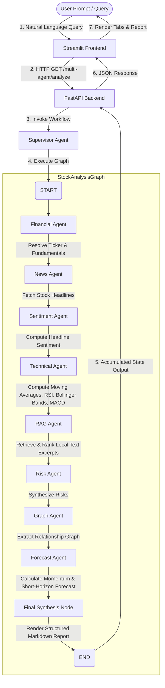

# Stock AI Analyst 📈

Stock AI Analyst is a professional-grade, multi-agent financial research assistant designed to turn natural-language queries (e.g., *"Should I invest in Nvidia?"* or *"Analyze Paytm"*) into comprehensive, structured investment reports.

Built using **LangGraph** for workflow orchestration, **LangChain** for design patterns and analysis heuristics, and **Streamlit** + **FastAPI** for its interface and API layer, this project models a state-of-the-art agentic analysis pipeline. The system runs deterministically, making it explainable, trace-friendly, and free from external LLM hallucination or call costs.

---

## 🛠️ Tech Stack

*   **Frontend Interface:** [Streamlit](https://streamlit.io/) (featuring metric dashboards, markdown rendering, and modular agent tabs)
*   **Backend API:** [FastAPI](https://fastapi.tiangolo.com/) (fully typed with Pydantic, hosting synchronous and asynchronous-ready endpoints)
*   **Orchestration Framework:** [LangGraph](https://github.com/langchain-ai/langgraph) (defining state management, sequential routing, and node transitions)
*   **Analysis Heuristics:** [LangChain](https://github.com/langchain-ai/langchain) (prompt abstractions, structured inputs, and mathematical/rule-based synthesis helpers)
*   **Data Aggregator:** [yfinance](https://github.com/ranaroussi/yfinance) (for real-time stock fundamentals, historical price data, and financial headlines)
*   **Local RAG Engine:** Built-in keyword ranker for parsing filings and earnings transcripts from local `.txt` documents

---

## 📐 System Design & Flow

### High-Level Architecture
The project is decoupled into a frontend UI (Streamlit) and backend services (FastAPI & LangGraph). 



### LangGraph State Management
The state of the system is tracked using `StockAnalysisState`, which gathers context from every node execution:
```python
class StockAnalysisState(TypedDict, total=False):
    query: str                   # The original user natural-language query
    ticker: str                  # Resolved stock exchange ticker (e.g. INFY.NS, NVDA)
    company_name: str            # Formal company name retrieved from yfinance
    financial: dict[str, Any]    # Financial metrics & fundamental summary
    news: dict[str, Any]         # Collected headlines
    sentiment: dict[str, Any]    # Computed sentiment label, scores & rationale
    technical: dict[str, Any]    # Technical indicators (RSI, Bollinger, MACD)
    rag: dict[str, Any]          # Excerpts and status from local text documents
    risk: dict[str, Any]         # Synthesized risks list
    graph: dict[str, Any]        # Entity relationships extracted from transcripts
    forecast: dict[str, Any]     # 30-day forecast targets & momentum analysis
    agents: dict[str, Any]       # Aggregated sub-outputs for frontend tab mapping
    final_analysis: str          # Final assembled markdown report
```

---

## 🤖 Meet the Agents

Every agent runs a specific step of the analysis pipeline. Below are the design and implementation details of the individual nodes:

| Agent | Purpose | Logic & Data Sources | Key Output Parameters |
| :--- | :--- | :--- | :--- |
| **Financial Agent** | Resolves ticker and fetches key fundamentals. | Normalizes company names (including aliases like *Paytm*, *Nykaa*, *Reliance*), resolves ticker codes, and queries the `yfinance` Ticker API. | Ticker, Company Name, Revenue Growth, PE, Margins, Market Cap. |
| **News Agent** | Collects company market news. | Pulls recent market and corporate headlines for the ticker from the `yfinance` news index. | Title, Publisher, Canonical URL, Publish Time. |
| **Sentiment Agent**| Gauges recent media sentiment. | Applies positive/negative keyword heuristics over aggregated news headlines to compute a sentiment score. | Sentiment Label (Positive/Negative/Neutral), Score, Headline Sample. |
| **Technical Agent**| Calculates price momentum and trends. | Queries historical prices to compute **RSI-14**, **SMA-50/200**, **EMA-20**, **MACD/Signal crossover**, and **Bollinger Bands**. | Technical Trend, Confidence, Calculated Indicator metrics. |
| **RAG Agent** | Inspects local filing and transcripts. | Scans `.txt` documents in `backend/data/filings` matching the resolved ticker, splits them into text chunks, and ranks them by word overlap. | Match status, Source filenames, Excerpts/Risk mentions. |
| **Risk Agent** | Aggregates and highlights key risks. | Analyzes valuations (PE thresholds), growth trends, sentiment profiles, technical momentum, and local RAG filings to output risk factors. | List of synthesized risk points. |
| **Graph Agent** | Maps external corporate relations. | Scans RAG transcripts and filters sentences for relationship verbs (partnership, supplier, customer, competitor) to isolate target corporations. | Relationship types, Targets, Source verification. |
| **Forecast Agent** | Runs a short-horizon outlook model. | Combines rolling price trends (5-day & 30-day returns), moving average configurations, and historical volatility to project 30-day returns. | Trend Direction, Expected Return %, Expected Price, Confidence. |
| **Final Synthesis Node** | Assembles the final markdown report. | Pulls state-aggregated data from every previous agent to compile a structured, easy-to-read markdown report. | Organized Analyst-style summary. |

---

## 🔌 API Documentation

FastAPI exposes the following HTTP endpoints on port `8000`:

### `GET /health`
A simple check to verify if the server is healthy.
*   **Response:**
    ```json
    { "status": "ok" }
    ```

### `GET /analyze`
Runs a quick single-agent lookup returning stock fundamentals.
*   **Query Parameters:**
    *   `query` (string, required): Ticker symbol or natural language question (e.g. `AAPL`, `Should I buy Nvidia?`).
*   **Response:**
    ```json
    {
      "query": "Should I invest in Nvidia?",
      "ticker": "NVDA",
      "company_name": "NVIDIA Corporation",
      "metrics": {
        "current_price": 140.25,
        "revenue_growth_percent": 94.2,
        "trailing_pe": 68.4,
        "forward_pe": 34.2,
        "market_cap": 3450000000000,
        "sector": "Technology",
        "industry": "Semiconductors"
      },
      "summary": "NVIDIA Corporation shows revenue growth of 94.20% and trades at a trailing PE of 68.40..."
    }
    ```

### `GET /multi-agent/analyze`
Executes the full LangGraph orchestration pipeline. This endpoint is consumed by the Streamlit frontend.
*   **Query Parameters:**
    *   `query` (string, required): The target query.
*   **Response (Truncated for readability):**
    ```json
    {
      "query": "Should I invest in Apple?",
      "ticker": "AAPL",
      "company_name": "Apple Inc.",
      "final_analysis": "### Executive view\n...",
      "agents": {
        "financial": {},
        "news": {},
        "sentiment": {},
        "technical": {},
        "rag": {},
        "risk": {},
        "graph": {},
        "forecast": {}
      }
    }
    ```

---

## ⚙️ Configuration Reference

Settings are driven by Pydantic Settings and loaded from environment variables or a `.env` file at the root directory.

| Variable Name | Type | Default Value | Description |
| :--- | :--- | :--- | :--- |
| `analysis_model` | `str` | `""` | Placeholder for model choice. |
| `rag_documents_dir` | `str` | `""` | Relative path to local `.txt` documents (defaults to `backend/data/filings`). |
| `max_headlines_considered` | `int` | `8` | Total headlines evaluated for sentiment analysis. |
| `max_risk_items` | `int` | `8` | Maximum length of compiled risk summary points. |
| `technical_rsi_period` | `int` | `14` | Rolling window length for RSI calculation. |
| `technical_sma_short_window`| `int` | `50` | Short-term SMA configuration. |
| `technical_sma_long_window` | `int` | `200` | Long-term SMA configuration. |
| `technical_bollinger_window`| `int` | `20` | Simple moving average period for Bollinger Bands. |
| `technical_rsi_overbought` | `float` | `70.0` | Threshold value where a stock is deemed overbought. |
| `technical_rsi_oversold` | `float` | `30.0` | Threshold value where a stock is deemed oversold. |
| `forecast_history_period` | `str` | `"6mo"` | Timeframe of yfinance data loaded for forecast evaluation. |
| `risk_trailing_pe_threshold`| `float` | `35.0` | PE valuation limit before flag is raised as valuation risk. |
| `rag_chunk_size` | `int` | `1200` | Character length for splitting transcript documents. |
| `rag_ranked_chunks` | `int` | `5` | Quantity of retrieved text chunks indexed for keyword lookup. |

---

## 📂 Project Layout

```text
stock-ai-analyst/
├── backend/                   # FastAPI Backend
│   ├── agents/                # LangGraph Node Workers
│   │   ├── financial_agent.py # Fundamentals collector
│   │   ├── forecast_agent.py  # Short-horizon trend forecaster
│   │   ├── graph_agent.py     # Relationship extractor
│   │   ├── news_agent.py      # Headlines aggregator
│   │   ├── rag_agent.py       # Document chunk ranker
│   │   ├── risk_agent.py      # Multi-factor risk synthesizer
│   │   ├── sentiment_agent.py # Keyword sentiment evaluator
│   │   ├── supervisor_agent.py# Outer wrapper for workflow invoke
│   │   └── technical_agent.py # Quantitative indicators engine
│   ├── api/
│   │   └── main.py            # FastAPI endpoints & Pydantic response models
│   ├── core/
│   │   └── config.py          # Settings validation & configuration layer
│   ├── data/
│   │   └── filings/           # RAG target directory for local document storage
│   ├── services/
│   │   └── langchain_service.py # Core analysis templates & algorithmic steps
│   └── workflows/
│       └── stock_graph.py     # LangGraph State & node sequential bindings
├── frontend/                  # Streamlit Frontend
│   └── streamlit_app.py       # High-level metrics, agent tabs, and query input
├── .gitignore
├── README.md                  # Detailed system instructions
└── requirements.txt           # Python application dependencies
```

---

## 🚀 Running the System

Follow these steps to run the frontend and backend locally:

### 1. Installation
Clone the repository and install dependencies inside a virtual environment:
```bash
# Set up a Python virtual environment (optional but recommended)
python -m venv venv
source venv/bin/activate  # On Windows use: venv\Scripts\activate

# Install the dependencies
pip install -r requirements.txt
```

### 2. Activate Local RAG (Optional)
To use retrieval-augmented generation:
1.  Navigate to `backend/data/filings` (create the folders if they do not exist).
2.  Drop text transcripts, 10-K, or earnings filings saved as `.txt` files in that folder.
3.  Name files starting with the ticker code (e.g. `AAPL_q3_transcript.txt`, `NVDA_annual_report.txt`) or keep them generic (e.g. `earnings.txt`).

### 3. Run the Backend API
Start FastAPI using Uvicorn:
```bash
uvicorn backend.api.main:app --reload
```
The server will start running on [http://127.0.0.1:8000](http://127.0.0.1:8000). You can explore the interactive API docs at [http://127.0.0.1:8000/docs](http://127.0.0.1:8000/docs).

### 4. Run the Streamlit App
Open a separate terminal window and launch the Streamlit frontend:
```bash
streamlit run frontend/streamlit_app.py
```
The app will open automatically in your browser (typically at [http://localhost:8501](http://localhost:8501)). Enter a stock-related question, press **Analyze**, and explore the reports!
